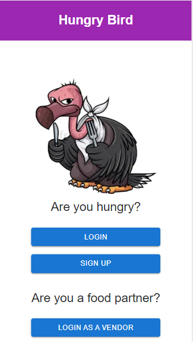
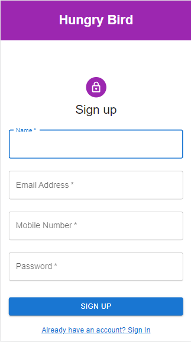

# Hungry-bird
A website to order food from canteens in our college  
<h4>Tech Stack used:</h4>
1. Node.js + Express.js - To develop Backend API 
2. ReactJS - To develop the User Interface 
3. OracleDB - Database to store data 

<h4>Functionalities</h4>
1. Users can login and order food
2. Vendors can login and see the pending orders in their respective canteens
3. Vendors can also update Menu

<h4>Images</h4>

